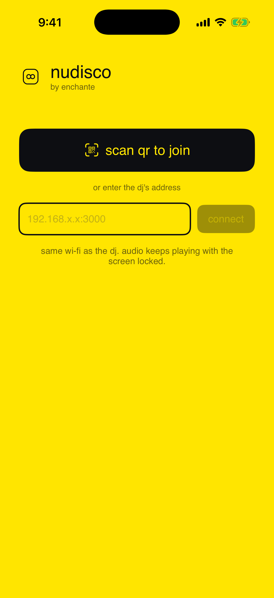
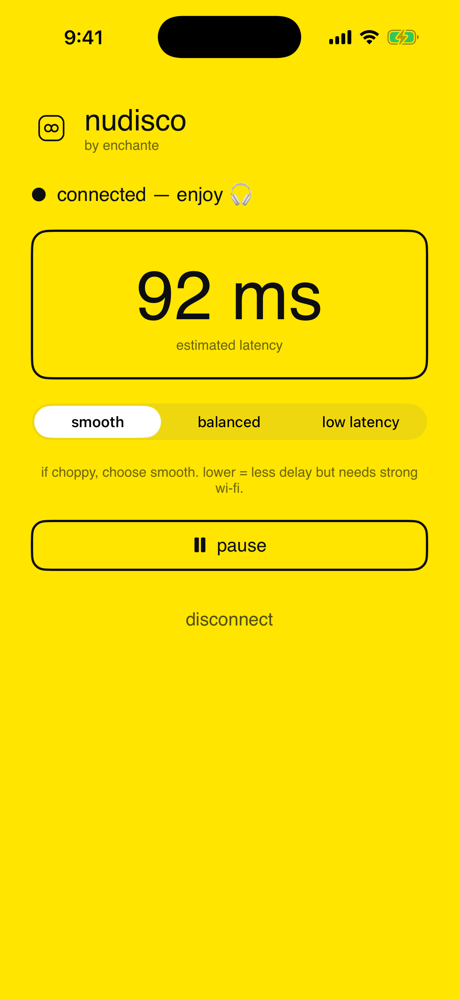

# nudisco — native iOS listener

A tiny native iOS app that listens to a nudisco broadcast **with the screen
locked / phone in your pocket** — which the web listener can't do (iOS Safari
suspends WebRTC the moment the screen locks). It also tends to run a bit lower
latency (~90–120 ms) thanks to a tighter native audio buffer.

It is **just another WebRTC listener** — it speaks the exact same signaling
protocol as the web page (`../src/signaling.js`), so the **Node server and the
broadcaster don't change at all**. The web listener still works for drop-in
guests who don't want to install anything; this app is for people who want to
pocket-lock.

**Status:** built and verified on-device — connects over the LAN, plays the live
broadcast, keeps playing with the screen locked, and shows estimated latency. See
**Troubleshooting** below for the three things that trip people up the first time
(microphone prompt, Local Network permission, signing team).

> Note: libwebrtc's Obj-C API drifts a little between releases (especially the
> audio-session and ICE calls). If you bump the `WebRTC` package to a much newer
> version and a method name no longer matches, the fix is usually a one-liner —
> the spots that touch it are `AudioSessionManager.swift` and `WebRTCClient.swift`.

---

| tap to join | connected (lock-screen playback) |
|---|---|
|  |  |

## Prerequisites
- A Mac with **Xcode** (16+).
- An **Apple Developer account** ($99/yr) — required for TestFlight (below). You
  can build to your own device with a free Apple ID, but TestFlight needs the paid program.
- [XcodeGen](https://github.com/yonaskolb/XcodeGen) to generate the project:
  `brew install xcodegen` (or set the project up by hand — see "Manual setup").

## Build & run
```bash
cd ios
xcodegen generate        # creates Nudisco.xcodeproj from project.yml
open Nudisco.xcodeproj
```
In Xcode:
1. Select the **Nudisco** target ▸ **Signing & Capabilities** ▸ pick your Team.
   (Signing also auto-adds the entitlement; the **Background Modes ▸ Audio**
   capability is already declared via Info.plist.)
2. If the **WebRTC** package fails to resolve, remove & re-add it: File ▸ Add
   Package Dependencies ▸ `https://github.com/stasel/WebRTC` ▸ "Up to Next Major"
   with the latest version. (It's a large prebuilt binary; first resolve is slow.)
3. Pick your iPhone, **Run**.

## Use it
1. Start the broadcaster on the Mac (`npm start`) and go **On air**.
2. In the app, tap **Scan QR to Join** and scan the QR on the broadcaster page
   (or type the address it shows, e.g. `192.168.1.50:3000`).
3. **Allow both first-run prompts**: *Local Network* (to reach the DJ's Mac) and
   *Microphone* (libwebrtc needs it to start the audio engine — nudisco records
   nothing). Audio plays — now **lock the phone**; it keeps playing, with
   lock-screen controls.

## TestFlight (so guests can install)
> **Full store/legal checklist** — privacy "nutrition label", required URLs, the
> all-important App Review notes (this app is LAN-only, so a reviewer needs a demo
> broadcaster), age rating, listing copy — is in **[APPSTORE.md](APPSTORE.md)**.
> The privacy manifest (`Nudisco/PrivacyInfo.xcprivacy`) and export-compliance flag
> are already in the project.

1. In App Store Connect, create an app record with bundle id
   `com.nudisco.listener` (or change it in `project.yml`).
2. Xcode ▸ **Product ▸ Archive** ▸ **Distribute App ▸ App Store Connect ▸ Upload**.
3. In App Store Connect ▸ **TestFlight**, add the build to **External Testing**,
   fill the test details, submit for the (light) beta review.
4. Enable the **public link** and share it. Guests: install **TestFlight** →
   open your link → install **nudisco** → scan the broadcaster QR.
5. Builds expire after **90 days**; upload a fresh one before the next party.

## Manual setup (no XcodeGen)
Create a new iOS App (SwiftUI, iOS 16+), add all files in `Nudisco/`, add the
SPM package `https://github.com/stasel/WebRTC`, then in **Info** add:
- `UIBackgroundModes` → item `audio`  (or Signing & Capabilities ▸ + ▸ Background Modes ▸ Audio)
- `App Transport Security Settings` → `Allow Local Networking` = YES
- `NSLocalNetworkUsageDescription` = "…connects to the DJ's computer on your Wi-Fi…"
- `NSMicrophoneUsageDescription` = "…audio engine needs the mic to start; never records…"
- `NSCameraUsageDescription` = "Scan the join QR code."
- `UIRequiresFullScreen` = YES (portrait-only without the iPad orientation warning)
Set **Swift Language Version = 5** to avoid strict-concurrency build errors.

## How it works (files)
| File | Role |
|---|---|
| `NudiscoApp.swift` | `@main`; configures the audio session **before** any peer connection |
| `AudioSessionManager.swift` | `.playAndRecord` session (background audio + speaker/Bluetooth routing) + lock-screen Now Playing/commands |
| `Signaling.swift` | WebSocket client speaking the nudisco protocol (`hello`/`signal`/`stats`) |
| `LocalNetwork.swift` | `NWConnection` primer that triggers iOS Local Network permission before the WebSocket |
| `WebRTCClient.swift` | recvonly `RTCPeerConnection`: applies offer, answers, plays audio, reports stats |
| `PlayerViewModel.swift` | orchestration: connect / reconnect / latency / buffer preset / pause |
| `ContentView.swift` | SwiftUI UI (scan-QR/connect, status, latency, buffer, pause) |
| `QRScannerView.swift` | camera QR scanner that reads the broadcaster's join QR |
| `BufferPreset.swift` | Smooth / Balanced / Low (mirrors the web presets) |

**About the microphone prompt:** libwebrtc's iOS audio engine runs one audio
unit (with an input element), so the session must be `.playAndRecord` and iOS
asks for the mic — **you must Allow it or no audio plays**. nudisco adds no local
track, so nothing is ever recorded or transmitted. (Fully removing the prompt
needs a custom playout-only audio device module — out of scope.)

RED + audio NACK offered by the broadcaster are decoded/honored by libwebrtc
automatically, so the same Wi-Fi loss resilience as the web carries over.

## On-device acceptance checklist
1. Scan QR → connects, audio plays.
2. **Lock the screen → audio keeps playing** (the whole point). Background the app → keeps playing.
3. First run prompts once for **Local Network** and **Microphone** — allow both.
4. Lock screen shows "nudisco — live" with working play/pause.
5. Latency readout is sane (ideally a bit lower than the web), audio is smooth.
6. Toggle Wi-Fi off/on → it auto-reconnects.

## Troubleshooting
- **Crash: "must contain an NSMicrophoneUsageDescription key."** libwebrtc's iOS
  audio engine initializes the mic audio unit even for receive-only. The key is
  in `project.yml` (`NSMicrophoneUsageDescription`) — re-run `xcodegen generate`.
  Allow the mic prompt; nudisco adds no local track, so nothing is recorded/sent.
- **WebSocket fails with error -1009 ("connection appears to be offline") to a
  LAN IP.** That's the iOS **Local Network** permission. The app pokes the host
  with an `NWConnection` (`LocalNetwork.swift`) to trigger the prompt — **tap
  Allow**. If you tapped Deny earlier: Settings ▸ nudisco ▸ Local Network ▸ on.
  (The web listener works without this because Safari is exempt.)
- **After `xcodegen generate`, signing resets** ("requires a development team").
  Set `DEVELOPMENT_TEAM: <your10charID>` in `project.yml` so it survives
  regeneration, or re-pick your Team in Signing & Capabilities each time.
- **QR scan does nothing / camera errors.** Grant camera access, or just type the
  address from the broadcaster page (e.g. `192.168.1.50:3000`) — same result.
- **Editor shows "No such module 'UIKit'/'WebRTC'".** Your editor is using the
  macOS SDK; build the **iOS** target in Xcode and they're gone.

## Not included
- **Android** — a separate app (same libwebrtc approach).
- Zero-config discovery (Bonjour) — for now use the QR / manual address.
