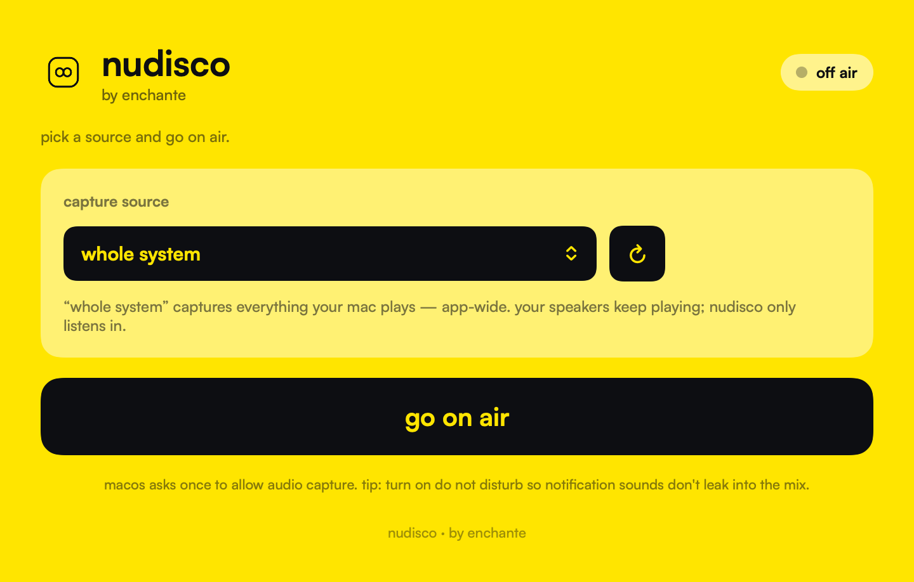
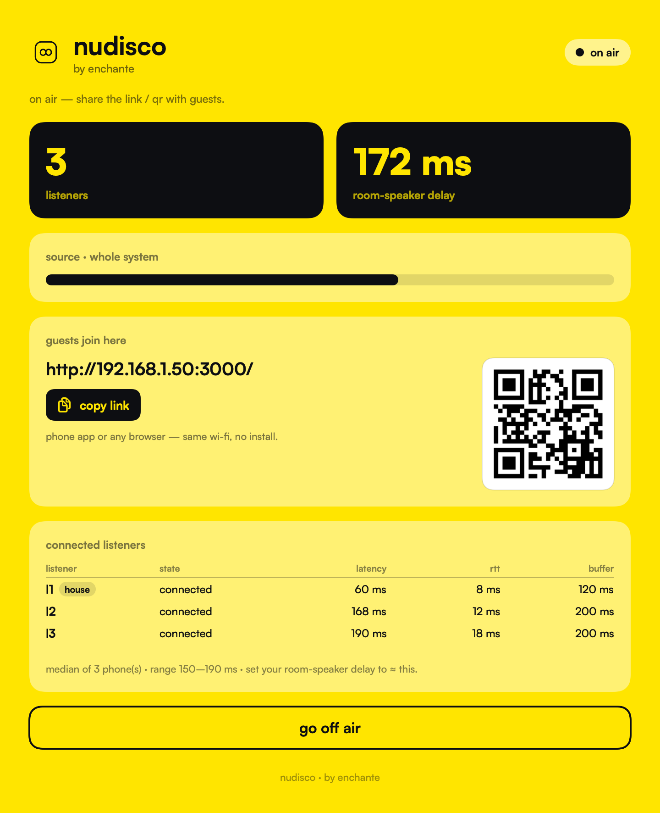

# nudisco — native macOS broadcaster

One app the DJ opens. **No BlackHole, no terminal, no Node server, no audio
routing setup.** It captures your computer's audio non-destructively (your
speakers keep playing), runs the signaling + serves the web listener itself, and
streams to guests over WebRTC — to both the **nudisco phone app** and any
**browser** on the same Wi-Fi, which are unchanged.

**Status:** **builds clean** (`xcodebuild` succeeds against the real WebRTC +
SwiftNIO packages — Debug, macOS). The remaining unknown is *runtime*: whether the
WebRTC macOS binary actually drives the custom audio device — confirm with the
**Test tone** in Spike 0 below, then run for real on-device.

Requires **macOS 14.2+** (Core Audio process taps) on the DJ's Mac.

| pick a source & go on air | live, with guests connected |
|---|---|
|  |  |

---

## Build & run
```bash
cd mac
xcodegen generate        # creates NudiscoBroadcaster.xcodeproj from project.yml
open NudiscoBroadcaster.xcodeproj
```
In Xcode: select the **NudiscoBroadcaster** target ▸ **Signing & Capabilities** ▸
pick your Team, then **Run**. (First package resolve pulls the prebuilt WebRTC
binary — slow once.)

Use it: pick a **capture source** (Whole system, a specific app like rekordbox,
or **Test tone**) → **go on air** → share the URL / QR. Allow the one-time
**audio-capture** prompt. Your speakers keep playing.

---

## ⚠️ Spike 0 — confirm audio actually flows (the one remaining risk)

The design depends on libwebrtc's custom-audio API (`RTCAudioDevice` +
`RTCPeerConnectionFactory(...audioDevice:)`). This **compiles** (see "the vendored
header" note below), and the macOS binary exposes the `audioDevice:` initializer —
but only a real run proves the macOS binary's audio device module actually pulls
our PCM. So:

1. **Run it, pick "test tone (sanity check)" as the source, go on air**, then open
   the join URL in a browser (or the phone app) on another device.
2. **You should hear a 440 Hz tone.** That proves PCM injection end-to-end:
   custom ADM → factory → mesh → signaling → listener. Everything else is
   well-trodden (the listener side is unchanged and already works with the web
   broadcaster these classes reimplement).
3. Then switch the source to **Whole system** / your DJ app and you should hear
   real audio while your speakers keep playing.

**If the tone never plays** (the macOS binary's ADM doesn't drive our device) —
Fallback A: switch the `WebRTC` package in `project.yml` to LiveKit's
`https://github.com/livekit/webrtc-xcframework` (product `LiveKitWebRTC`, known to
support macOS custom audio). Its symbols are prefixed `LKRTC…` and the module is
`LiveKitWebRTC`, so it's a mechanical rename across `mac/`'s WebRTC-importing files
(the iOS app stays on stasel — same wire protocol, they interoperate).

### The vendored header (why `Vendor/RTCAudioDevice.h` exists)
stasel/WebRTC ships `RTCAudioDevice.h` for iOS/Catalyst but **omits it from the
macOS slice** (M120 *and* M149), even though the macOS binary implements the
`audioDevice:` initializer — so a macOS build hits "Cannot find type
'RTCAudioDevice'". We vendor the ABI-matched header from the same package's iOS
slice (`Vendor/RTCAudioDevice.h`, BSD-licensed upstream WebRTC; it has no iOS-only
deps) and expose it via `Vendor/NudiscoBridging.h`. If you ever bump the `WebRTC`
package and the macOS slice starts shipping the header in its umbrella, you can
delete the vendored copy + bridging-header settings.

---

## How it works (files)
| Area | File | Role |
|---|---|---|
| Audio | `Audio/ProcessTapCapture.swift` | Core Audio process tap (system or per-app), non-destructive; drives delivery + level meter |
| Audio | `Audio/NudiscoAudioDevice.swift` | custom `RTCAudioDevice` (ADM) — pushes captured PCM into libwebrtc |
| Audio | `Audio/PCMConverter.swift` | float32 → int16 same-rate convert (WebRTC resamples to 48k) |
| Audio | `Audio/SineToneSource.swift` | the **Test tone** producer for Spike 0 |
| Audio | `Audio/AudioProcessList.swift` | enumerate audio-producing apps for the picker |
| WebRTC | `WebRTC/WebRTCFactory.swift` | one factory wired to the custom ADM; shared outgoing track |
| WebRTC | `WebRTC/BroadcastEngine.swift` | the mesh: one peer per listener (port of `mesh-broadcaster.js`) |
| WebRTC | `WebRTC/BroadcastPeer.swift` | one offerer peer connection (RED-first, ICE buffering, RTT) |
| WebRTC | `WebRTC/SdpMunge.swift` | Opus stereo/160k/FEC + NACK + RED-first SDP (port of `configureOpus`/`preferRed`) |
| Vendor | `Vendor/RTCAudioDevice.h`, `Vendor/NudiscoBridging.h` | the missing-on-macOS WebRTC header, vendored + bridged (see Spike 0) |
| Server | `Server/EmbeddedServer.swift` | SwiftNIO HTTP + WebSocket on one port (replaces `src/server.js`) |
| Server | `Server/HTTPHandler.swift` | serves bundled `public/`, `/api/info`, `/qr.svg` |
| Server | `Server/WebSocketUpgradeHandler.swift` | `/ws` connection ↔ hub |
| Server | `Server/SignalingHub.swift` | 1:1 port of `src/signaling.js` (broadcaster in-process) |
| Server | `Server/LanIP.swift`, `Server/QRSvg.swift` | LAN IP (prefer en0) + QR SVG |
| UI | `UI/ContentView.swift`, `UI/BroadcastViewModel.swift` | DJ UI + orchestration (mirrors `broadcast.js`) |
| UI | `UI/ListenerRow.swift`, `UI/QRImageView.swift`, `UI/Brand.swift` | table, QR, enchante styling |

The repo's `public/` web listener is **bundled unchanged** (a folder reference in
`project.yml`) and served by the embedded server, so the unchanged web + iOS
listeners interoperate. The Node `src/server.js` path is untouched and still works
for development.

### Why no BlackHole, and why it's non-destructive
A Core Audio process tap *observes* the output of the system (or one app) and
delivers a copy; it does not reroute or mute it (`muteBehavior = .unmuted`), so the
room speakers keep playing. Capturing a specific app (rekordbox/Serato) avoids
picking up notification sounds; for whole-system capture, turn on Do Not Disturb.

---

## Distribution (download from a website)
`Distribution/notarize.sh` builds a **universal**, **Developer ID-signed**,
**notarized**, **stapled** DMG (hardened runtime + `NSAudioCaptureUsageDescription`
are already in `project.yml`). Configure `TEAM_ID` / `DEV_ID_APP` /
`NOTARY_PROFILE` and run it. Upload the DMG; Gatekeeper accepts it on any Mac.

**Full publishing guide (and why Developer ID, not the Mac App Store, for this app):
[PUBLISHING.md](PUBLISHING.md).**

---

## On-device acceptance checklist
1. Build succeeds → the custom-audio API is present (Spike 0 part 1).
2. Source = **Test tone** → a listener hears a 440 Hz tone (Spike 0 part 2).
3. Source = **Whole system** (or rekordbox) → **room speakers keep playing** and
   the level meter moves; a browser listener AND the phone app both hear the audio
   **at once**.
4. First run shows the audio-capture prompt once; no other setup.
5. Listener count, the per-listener latency table, and the recommended
   room-speaker delay populate.
6. Change the Mac's output device mid-broadcast → audio recovers.

## Troubleshooting
- **Build error: cannot find `RTCAudioDevice`** → the vendored header / bridging
  header isn't wired; check `SWIFT_OBJC_BRIDGING_HEADER` in `project.yml` and that
  `Vendor/RTCAudioDevice.h` + `Vendor/NudiscoBridging.h` exist, then regenerate.
- **Test tone never plays** (audio device module doesn't drive our PCM) → Fallback A
  (LiveKit) in Spike 0 above.
- **"Couldn't start audio capture"** → the audio-capture permission was denied:
  System Settings ▸ Privacy & Security ▸ (Audio capture / Screen & System Audio) ▸
  enable nudisco. macOS 14.2+ is required.
- **A phone can't connect over `http://`** → same as the Node server; a future
  optional self-signed HTTPS mode would solve it (out of scope for v1).
- **Editor shows "No such module 'WebRTC' / 'NIOCore'"** → those are SPM packages;
  they resolve only inside an Xcode build, not a plain editor.
- **A WebRTC method name doesn't match** (e.g. `rtpSenderCapabilities(for:)`,
  `setCodecPreferences`, `networkPriority`) → libwebrtc's Obj-C API drifts a little
  between releases; these are one-line fixes, confined to `WebRTC/BroadcastPeer.swift`
  and `WebRTC/WebRTCFactory.swift`. (Same caveat as the iOS app.)

## Regenerating the screenshots
The images in `Screenshots/` are rendered by the app itself (DEBUG-only
`ScreenshotExporter`, via SwiftUI `ImageRenderer` — no Screen Recording needed).
After building a Debug `.app`:
```bash
APP=…/NudiscoBroadcaster.app
open "$APP" --args --shot "$PWD/Screenshots/01-setup.png"          # off-air
open "$APP" --args --shot "$PWD/Screenshots/02-on-air.png" --demo  # populated on-air (mock data)
```
This code is `#if DEBUG`-only and never ships in Release.

## Not included (v1)
Android · HTTPS/self-signed mode · macOS < 14.2 · Bonjour zero-config discovery.
